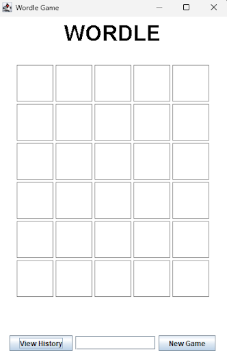
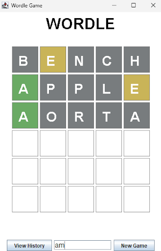
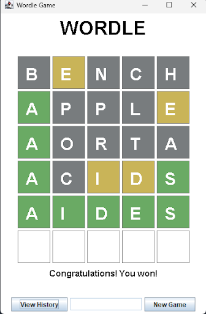
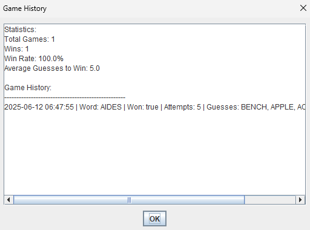

# Final Project Wordle Game
This project allows the creation and display of the wordle game with the randomly generated words using the [Datamuse](https://www.datamuse.com/api/) API and through Java Swing.

# Code Breakdown
## API.java
- Contains the method used for GET requests from the API
- ### public static String getData(String endpoint):
  - Method that Ms. Turin provided
## Display.java
- Create the Display object which is a subclass of JPanel to display all the info along with all the neccessary methods
- ### public Display():
  - Setup the initial JPanel display:
    - Set the layout of panel for easier managing of Swing components
    - Change size to frame the game neatly
    - Create a wordle game ready on launch using WordleGame() constructor
- ### private void createControlPanel():
  - Creates and adds the multiple swing components to the panel used to control the game at the bottom of the display
    - Create an inputField from a textField instance variable, used for input and guessing words
    - Create a newGameButton from a JButton instance variable which restarts the game
    - Create a viewHistoryButton from a JButton instance variable which opens a separate window to view past games and stats using showGameHistory
- ### public void paintComponent(Graphics g):
  - Overridden from the inherited JPanel superclass and used for drawing the grid and words
  - Draws message for win and lost
- ### public void actionPerformed(ActionEvent e):
  - Overridden from ActionListener interface
  - Handle all the JButtons by checking the source of the action
- ### private void showGameHistory():
  - Create and display the gameHistory and stats in a seperate window
- ### private void handleGuess():
  - Updates the game after each guess
    - Called after guess is inputted
    - Check to see if guess is a valid 5 letter word
    - Updates info to be stored in gameRecord and gameHistory
    - Updates the grid by calling updateGrid method
- ### private void updateGrid(String guess, ArrayList<String> results):
  - Update the grid when a guess is inputted, adding the word and color.
  - Calls repaint which refreshes the paintComponent so info is updated
## GameHistory.java
- Write and read past wordle games from a txt file 
- ### private void loadHistory():
  - Read the txt file and check to see if each line follows a format
    - Read the info and used to make a GameRecord object which just neatly formats the info  
- ### private void saveHistory():
  - Write the info from the list of GameRecord objects into the txt file
## GameRecord.java 
- Class used to create GameRecord objects which has variables to store all the necessary info for a game
- ### public String toString():
  - Overridden method used to format and display the game info in the GUI
- ### public String toFileString():
  - Formats the text when written to the txt file
## GameStats.java
- Formats the statistics when displayed
- ### public String toString():
- Overridden method that formats a string with all the stats when the object is printed
## WordleGame.java
- Handles the game logic of Wordle itself such as checking guess against the secret word and generating the secret word
- ### private static final String API_URL
  - Contains the URL link inputted to the getData method in API class that always returns random 5-letter words
- ### private void loadWords() throws Exception:
  - Called to get the words from the API by calling getData on the API_URL
  - Parses the response after to get just the word and added to a list of validWords
- ## private ArrayList<String> checkGuess(String guess):
  - Called to check the guess against the actual word
  - First checks to see if the letters in guess match the letters in the word exactly when it is green
  - Then checks for letters not in the exact same spot, yellows, using a nested for loop.
  - Returns an arrayList of Strings of whether it's green, yellow, and gray for each index of the 5 letters.
# Features Implemented
- [x] Base Project (88%)
    - Connects to Datamuse API
    - Uses 7 Java classes
    - Parses through Datamuse API to get random 5-letter words
    - Outputs stats, game history, and the random word.
- [x] Statistics / Machine Learning / Basic Computation (6%)
    - Calculate average win rate across all games
    - Calculate average guesses to win a wordle game
- [x] GUI (2%)
    - Use Java Swing to display the guesses and allow for inputs
- [ ] ~~Web-based Front End~~
- [x] Save/Load Data (2%)
    - Save every wordle game data by storing info in GameRecord objects and writing to a wordle_history txt file
    - Read the wordle_history txt file to be displayed every time GameHistory object is created
- [x] Filter/Sort Data (2%)
    - Filters information in API response by getting only the word
    - Filters the info from txt file by checking it follows a set format, each line has five separate parts
- Total = 100%
# Screenshots

# What I Learned
- How to use GET requests and APIs
- How to read and parse JSON data
- Java Swing and how to create an interactable GUI
- Writing and reading data in a text file
- Process of creating a project (how to organize classes, where to start)
